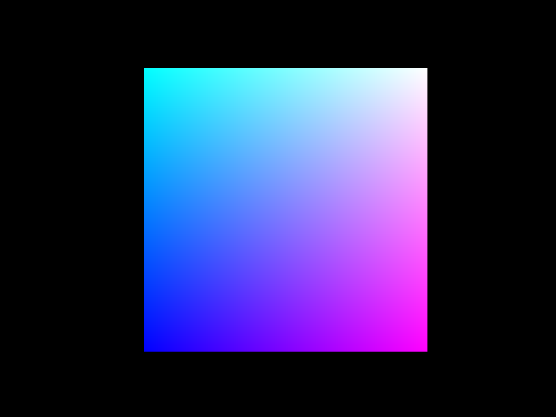

# C++ OpenGL 3D Engine
A basic OpenGL 3D engine to render scenes with binocular vision to drive a 3D display.

## Current Features
### **GLSL Shaders:**
<div align="center">
	 
</div>

#### Vertex Shader
```glsl
#version 330 core

layout(location = 0) in vec3 in_position;
layout(location = 0) in vec3 in_color;

out vec4 v2f_color;

// Model, View, Projection (MVP) matrix
uniform mat4 MVP;

void main()
{
	gl_Position = MVP * vec4(in_position, 1);
	v2f_color = vec4(in_color, 1);
}
```
#### Fragment Shader
```glsl
#version 330 core

// input color from vertex shader
in vec4 v2f_color;

layout(location = 0) out vec4 out_color;

void main()
{
	out_color = v2f_color;
}
```

### **Camera rotation and translocation:**
<div align="center">
	 
</div>
